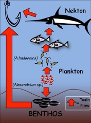
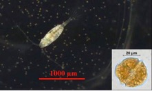
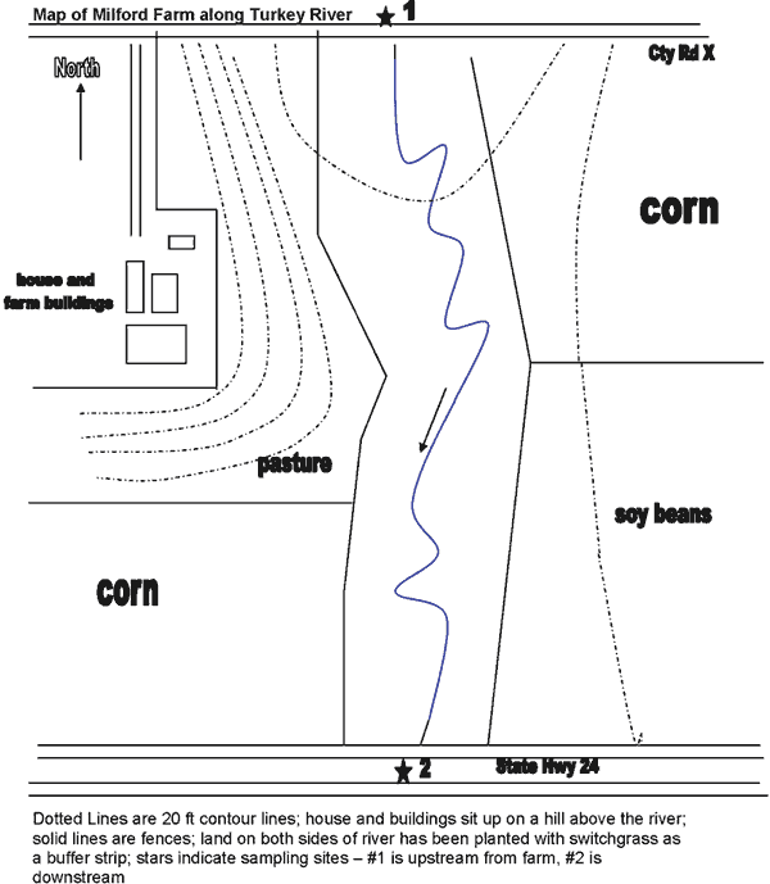
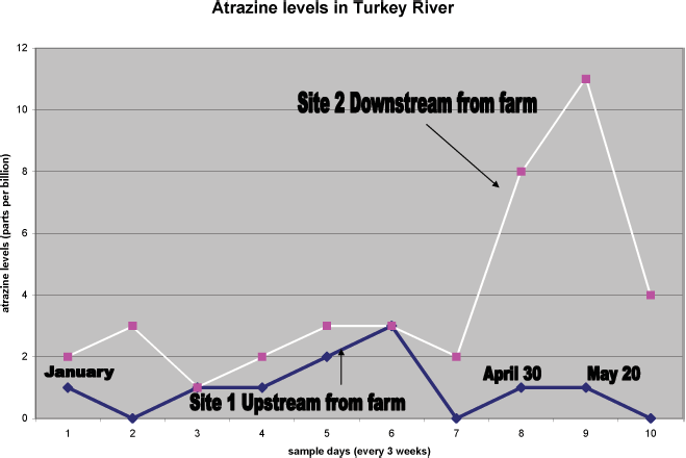
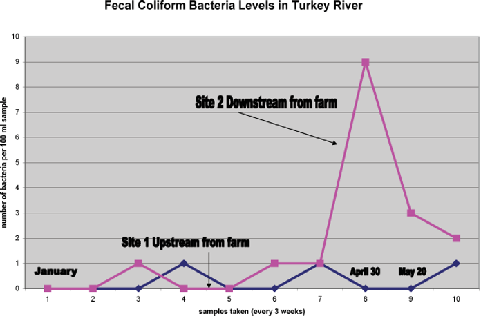
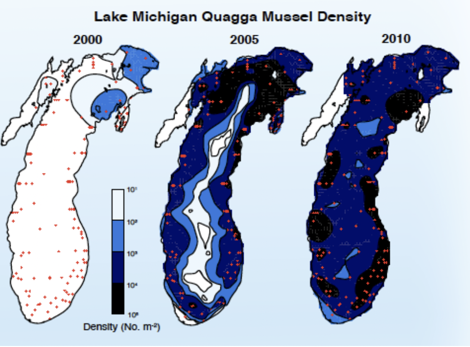
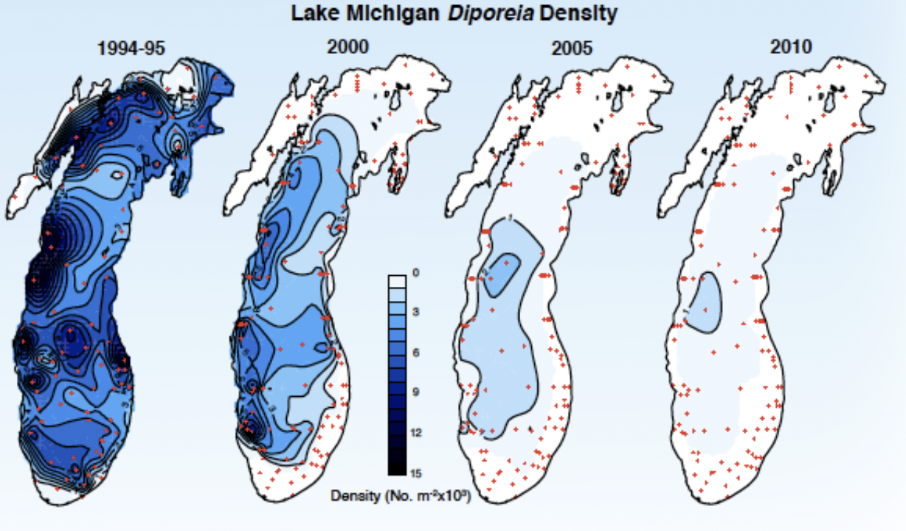
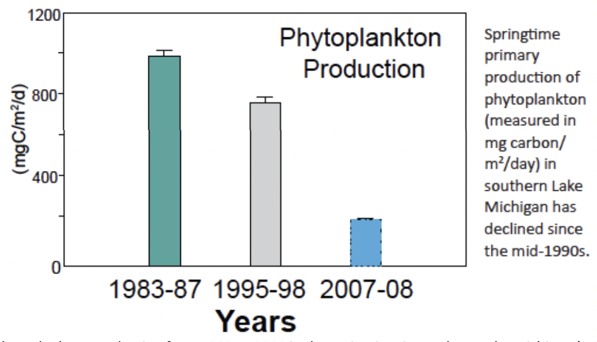

# (PART\*) Labs 1 & 2 {-}

*Last updated `r Sys.Date()`*

# Planning Your Experiment {-}

There is a lot to consider when developing an experiment to answer the problem you have outlined in front of you. 

The link below will help you sort out best practices in experimental design.  It is highly recommended that before you come to the lab to start designing your experiment that you take the time to review the material from BIOL 116 in the link below starting with the "statement of hypothesis" to "conducting the research".

[Experimental Methodology - What you need to know to design your experiment](https://ubco-biology.github.io/BIOL-116-Lab-Manual/statement-of-hypothesis.html)

# Assignment 1: Primary Source Papers {-}

## Overview {-}

**Due before the start of your lab the week of January 24th.  Please ensure you submit each summary to the specific submission locations on [Canvas](https://canvas.ubc.ca/courses/113910). Submitting all in one location will result in a mark of zero.**

Your TA will assign you one of the following topics for this assignment: Fish Population, Macroinvertebrates, or Invasive Mussels. Details about each of these projects can be found in the following pages of this lab manual.

Please read the [Types of Sources](https://ubco-biology.github.io/Procedures-and-Guidelines/types-of-sources.html) section of the Procedures and Guidelines Document to review the differences between primary, secondary, and review sources, and to see examples of each type.

For each primary paper, you will need to select one figure you feel provides the most relevant information for your topic.  You will need to include the following information. **The 5 figure summaries must be submitted prior to the start of your lab the week of January 24th.**  This submission will be done online.  You can work with your partner on selecting the 5 papers but this is an independent assignment.  Be aware of plagiarism when working together. For your assignment be sure to include:

* The figure and its caption
* The URL for the paper itself
* A clear and concise description of the information provided by this figure (a couple of sentences)
* An explanation for how this information is relevant for your study

**Here is an example submission**: [primary_source_paper_example_submission.docx](files/primary_source_paper_example_submission.docx)

## Primary Source Paper Rubric {-}

**Total\ /9**

### Figure Selected {-}

**\ /3**

**Criteria**

- Figure and its caption is provided
- URL for paper is provided
- Figure is from the URL provided

| Points | Criteria |
| :--- | :--- |
| Full Marks 1.5 pts | All 3 criteria are met |
| Satisfactory 1 pts | 2 of the 3 criteria are met |
| Unsatisfactory 0.5 pts | Only 1 of the criteria is met |
| Incomplete 0 pts | None of the criteria are met |

### Description of Figure {-}

**\ /3**

**Criteria**

- Description provided is clear and easy to follow
- Description provided accurately describes the figure provided
- Description indicates that the student has a clear understanding of the information being conveyed by the figure

| Points | Criteria |
| :--- | :--- |
| Full Marks 1.5 pts | All 3 criteria are met |
| Satisfactory 1 pts | 2 of the 3 criteria are met |
| Unsatisfactory 0.5 pts | Only 1 of the criteria is met |
| Incomplete 0 pts | None of the criteria are met |

### Relevance to Study {-}

**\ /3**

**Criteria**

- Explanation is clear and the rationale
- Student has provided a convincing explanation of the relevancy of this figure
- Student shows a clear understanding of the significance of this figure to their study

| Points | Criteria |
| :--- | :--- |
| Full Marks 1.5 pts | All 3 criteria are met |
| Satisfactory 1 pts | 2 of the 3 criteria are met |
| Unsatisfactory 0.5 pts | Only 1 of the criteria is met |
| Incomplete 0 pts | None of the criteria are met |

## Fish Population Project {-}

### Fish population declines: Mitigation recommendations needed {-}

Phytoplankton, microscopic single-celled algae, are natural components of aquatic ecosystems and are natural components of aquatic ecosystems and are responsible for half of the carbon and oxygen produced by plants in the world. Some phytoplankton species, however, produce toxins. These toxin producing algae are becoming more common and showing up in more places worldwide. Some of these toxins will produce neurotoxins that prevent nerve transmission signals, resulting in negative effects in animals that consume it. Toxins from phytoplankton can be transferred through the food web and accumulate in higher trophic levels, causing mortality in shellfish, fish, sea birds, and humans. Humans that eat contaminated shellfish can become sick and die. A major challenge for aquatic scientists and environmental managers is to predict the response of animal populations to the proliferation of toxic phytoplankton. A great deal of scientific effort is spent trying to understand the population dynamics of toxic algal blooms and their effects on the food web.

A vital link between phytoplankton and higher trophic levels is provided by copepods, a type of zooplankton.  Zooplankton are animal-like plankton that need to ingest other organisms to survive. Copepods are estimated to be the most abundant animals on the planet and are the main food source for many larval fish species.  This leads to the refrain: no copepods no fish.  

The toxic dinoflagellate genus *Alexandrium* spp. Often blooms from Long Island Sound in the United Sates, to the Bay of Fundy, Canada (Figure 3). This bloom results in negative effects in animals (grazers) that consume it and these toxins can accumulate in the higher trophic levels, causing mortality in fish, sea birds and humans.  In order to better predict the response of animal populations to the proliferation of toxic phytoplankton, *Alexandrium fundysense*, scientist studied the populations of the copepod *Acartia hudsonica* found in two different regions of the distribution from the Bay of Fundy, Canada, to about Long Island sound, New York and Connecticut. There are frequent and high toxicity levels in the norther region of this range (e.g., Maine) and no toxic blooms recorded in the southern regions (e.g., New Jersey).

Scientist discovered that at maximum ingestion rates the Maine population had higher egg production compared to the New Jersey population (Figure 4) however when copepods were ingesting non-toxic phytoplankton there were no differences in egg production between these populations (Figure 5).

![Figure 4.Ingestion rate (feeding; left) and egg production rate (reproduction; right) for copepods feeding on a diet containing toxic *Alexandrium* spp.  Ingestion rates were measured over a range of food concentrations while egg production rates correspond to a single concentration.  Food saturation occurs around 500 µgCL-1; this means that this concentration represents maximum ingestion and egg production.  Scientist chose this concentration for egg production because this is where the greatest difference, if any, in ingestion rate occurred.  The Maine population (red) had statistically higher ingestion and egg production rate compared to copepods from New Jersey (green).  Units for the dependent variable are in micrograms of carbon (µgC; food) and per copepod per day (ingestion and egg production).  Error bars represent standard deviation among replicates in egg production; they are omitted for clarity from ingestion rates.  Data adapted from Colin and Dam (2007, 2004).](images/figure4.png)

![Figure 5.Ingestion rate (feeding; left) and egg production rate (reproduction; right) for copepods feeding on a n o-toxic diet.  Ingestion rates were measured over a range of food concentrations while egg production rates correspond to a single concentration.  Food saturation occurs around 500µgCL-1; this mean as that this concentration represents maximum ingestion and egg production.  There were no differences between the Maine (red) and New Jersey (green) populations for both ingestion and egg production rate compared.  That is, the two populations fed and reproduced at the same rate.  Units and errors bars are the same as Figure 1. Data adapted from Colin and Dam (2007, 2004).](images/figure5.png)

There is still much to learn about the fecundity, mortality and growth of copepods in response to toxic algae.  Scientist need to better understand the interaction between toxic algae and their grazers and the adaptability of copepods to toxic algae.  Understanding these relationships is key to being able to predict and mitigate issues surrounding fish populations.

**Your Role**

You have been hired by National Freshwater Copepod Conservation and Fish Restoration agency (NFCCFR) to investigate the impacts of toxic algae on copepod populations. The NFCCFR is interested to know what negative effects, if any, can toxic algae produce in the copepod population in freshwater populations.  

Due to budget constraints you and your partner will need to conduct this research in lab and provide the NFCCFR with a proposal for approval prior to initiating your research. (The NFCCFR is your TA in case you were wondering). Before you can begin developing your proposal you must first become immersed in your topic. You and your partner will need to source out **5 primary source papers** related to this topic.

## Macroinvertebrates Project {-}

### Potential changes in macroinvertebrates: Mitigation recommendations needed {-}

In Lannisport, a major town located in the city of Westeros, water sampling has been conducted by the Friends of the Turkey River Organization every three weeks from January to June in order to monitor the impacts of the Milford Farm on the Turkey River (Fig. 6). 

There is growing concern that the levels in glyphosate and/or bacteria levels may impact the macroinvertebrate population found in the Turkey river. Data shown below on glyphosate levels (Fig. 2) and fecal bacterial levels (Fig. 3) have been collected every three weeks by a water quality sampling team.

There is serious concern about the impacts of the farm to the water quality of the creek.  The growing concern is whether or not these changes in glyphosate or bacteria levels will result in changes to the macroinvertebrate population and thus the trout population. Both macroinvertebrates and fish populations are used to assess river health however as macroinvertebrate populations are a large source for many animals in this ecological system, the Friends of the Mission Creek (FMCO) and the National Wildlife Federation (NWF) are currently interested in looking at macroinvertebrates specifically.

**Your Role**

You have been hired by the Friends of the Mission Creek Organization (FMCO) and the National Wildlife Federation (NWF) to investigate how this happened, what the possible effects are on the aquatic life and what can be done to prevent it from happening again.

Due to budget constraints you and your partner will need to conduct this research in lab and provide the FMCO and the NWF with a proposal for approval prior to initiating your research. (The FMCO and NWF will be represented by your TA in case you were wondering). Before you can begin developing your proposal you must first become immersed in your topic.  You and your partner will need to source out **5 primary source papers** related to this topic.

## Invasive Mussles Project {-}

### Invasive Mussel Project – Mitigation Recommendations Needed {-}

Both the zebra and quagga mussels have been shown to be extremely destructive in the Great Lakes (NOAA, 2008). Originally from Eastern Europe they were introduced here in Canada through ballast water discharge from ships, first the zebra mussels in the 80’s and then the quaggas in the 90’s. As of late it appears the quagga mussels can outcompete the zebra mussels due to their ability to tolerate colder temperatures, live I soft sediment and have a much longer siphon for feeding. The NOAA’s Great Lakes Environmental Research Laboratory (GLERL) have been monitoring the issue since the arrival of the quaggas. The map below (Fig. 1) illustrate how quickly the quaggas have dominated the area.

Food production for native species have been declining since the introduction of these invasive mussels and in particular the shrimp-like organisms called *Diporeia* as shown in the Figure 1.

Along with increased mussels and decreased *Diporeia* researchers have seen an increase in the size and number of harmful bottom-dwelling alga in the Great Lakes. One such algal is called *Cladophora*, which makes its way on to beaches in clumps rendering the beaches unpleasant due to their unsightly and smelly nature and also impact nutrient levels in the water (NOAA, 2008). 

The decline in *Diporiea* has resulted in some fish changing diet to a less nutrient rich diet in order to survive. As recreational fishing has a huge presence in the Great Lakes the presence of these invasive mussels has taken its toll on the economy (NOAA, 2008). Alongside this, the tourism industry has been impacted due to the less enticing beach quality that has resulted from the *Cladophoral* blooms (NOAA, 2008). Consequently, the GLERL has hired you to further investigate why and how this relationship is taking place in order to determine what mitigation strategies may be implemented.

**Your Role**

You have been hired by the Great Lakes Environmental Research Laboratory (GLERL) to investigate the relationship seen between invasive mussels and the harmful algal blooms. The GLERL is interested to know how these two populations are connected and what mitigation strategies can be implemented to help. Due to budget constraints you and your partner will need to conduct this research in lab and provide the GLERL with a proposal for approval prior to initiating your research. (The GLERL is your TA in case you were wondering). Before you can begin developing your proposal you must first become immersed in your topic. You and your partner will need to source out **5 primary source papers** related to this topic.