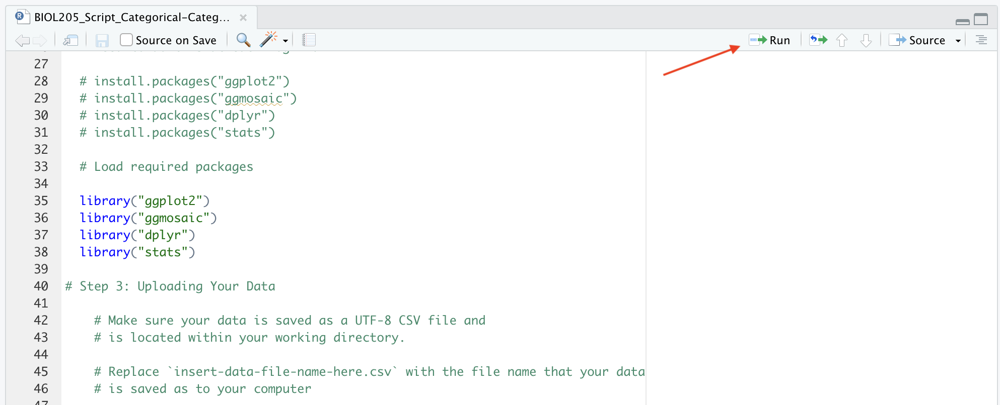

# (PART\*) Lab 4 - BIOL 205 {-}

*Last updated `r Sys.Date()`*

# Open Science, R, & RMarkdown Tutorial {-}

You were introduced to Open Science practices, RMarkdown, and RStudio when you completed a Recommendation Report in BIOL 125. We will be using the same format and a similar template for your Registered Report in BIOL 205. However, instead of using a Shiny App to visualize your data, we'll be using R Scripts with almost all the code already written for you.

To prepare you for this, you must first review some refresher Open Science, R, & RMarkdown tutorials, read and complete some short activities with some new material on working with the provided `R` scripts, and then complete the accompanying quiz in Canvas.

## Overview {-}

### Open Science {-}

Open Science is a movement that tries to combat the <a href="https://ubco-biology.github.io/Procedures-and-Guidelines/glossary#Replication-crisis">replication crisis</a>, <a href="https://ubco-biology.github.io/Procedures-and-Guidelines/glossary#Questionable-research-practices">questionable research practices</a>, and flashy research trumping quality research in two ways. First, by providing different incentives and rewards for research. That is, changing what we measure as a success in research, shifting from a culture that emphasizes novel findings to one that also rewards the many other aspects of practicing good science. Second, by making all parts of the scientific research process <a href="https://ubco-biology.github.io/Procedures-and-Guidelines/glossary#Transparency">transparent</a> and accessible, allowing for a critical review of how a study was conducted, and ultimately enabling that study to be independently <a href="https://ubco-biology.github.io/Procedures-and-Guidelines/glossary#Replication">replicated</a>. 

<div class = "advanced">
For an optional refresher of Open Science principles and core values, visit the [Open Science 101 Module](https://ubco-biology.github.io/OS-Introduction/principles-of-open-science.html) that was covered in BIOL 116.
</div>

### Registered Reports {-}

Writing a <a href="https://ubco-biology.github.io/Procedures-and-Guidelines/glossary#Registered-report">registered report</a> involves submitting your research question, <a href="https://ubco-biology.github.io/Procedures-and-Guidelines/glossary#Hypothesis">hypotheses</a>, and planned methods for <a href="https://ubco-biology.github.io/Procedures-and-Guidelines/glossary#Peer-review">peer review</a> prior to beginning data collection. Using this format enhances research quality because it gives researchers a chance alter study design and methods before investing time into data collection. Just think of a time where you spent countless hours writing an essay thinking it was perfect, only to give it to a friend to read and receive a ton of editing comments. Often readers notice things the author doesn't! Pre-registering a report also helps avoid questionable research practices like selective reporting of results and publication bias. 

For your Registered Report in BIOL 205, you will follow the stages of a typical <a href="https://ubco-biology.github.io/Procedures-and-Guidelines/glossary#Registered-report">registered report</a> and implement the following Open Science practices while working on your project:

* Using appropriate <a href="https://ubco-biology.github.io/Procedures-and-Guidelines/glossary#Version-control">version control</a> on electronic documents and proper <a href="https://ubco-biology.github.io/Procedures-and-Guidelines/glossary#File-and-data-management">file and data management</a> practices throughout the experiment. 
    * Be sure to follow the rules outlined in Chapters 1-5 [File and Data Management](https://ubco-biology.github.io/Procedures-and-Guidelines/file-and-data-management.html) in the UBCO Biology Procedures & Guidelines Document.
* Performing a <a href="https://ubco-biology.github.io/Procedures-and-Guidelines/glossary#Literature-review">literature review</a> on your research topic and documenting a list of consulted studies, how they were found, and the strengths, limitations, and weaknesses of each.
* Submitting a registered report draft with an established <a href="https://ubco-biology.github.io/Procedures-and-Guidelines/glossary#A-priori-hypothesis">a priori hypothesis</a>, experimental design, and plan for presenting and analyzing your data. This will be marked before the experiment implementation phase and TA feedback incorporated into the project as needed. Creating a detailed, thorough plan for your research often takes as much time as running the experiment and collecting and analyzing your data. The more you plan, including anticipating potential problems, the easier the implementation!
* Implementing the study according to your plan, and noting any deviations from that plan (Note: deviations often happen, and that's OK! The key is to document them). These reflections will be submitted for marks.
* Submitting and presenting a poster that details your experiences implementing the research plan (including any changes recorded, justification for changes, <a href="https://ubco-biology.github.io/Procedures-and-Guidelines/glossary#Statistical-analysis">analysis</a> of the data, and your interpretation and conclusion).

### Why Use R & RMarkdown? {-}

While there are numerous programs that you can use to write lab reports, research manuscripts, and perform <a href="https://ubco-biology.github.io/Procedures-and-Guidelines/glossary#Statistical-analysis">statistical analysis</a>, there are so many benefits to using <a href="https://ubco-biology.github.io/Procedures-and-Guidelines/glossary#R">R</a> & RMarkdown!

First, R is both free and open source! Moreover, using R allows for computational reproducibility of your work. Computational reproducibility is the ability to document data and analyses so that others can understand and replicate the computations that led to the results and conclusions.

While you could use R to perform statistical analyses and write your report separately using a program like Microsoft Word. By using RMarkdown to write your lab report, you can include data analyses directly within the report which allows for everything to be stored in a single document. This makes it simple for readers to understand the computations used to conduct analyses as they read through your paper. Also, remember that there are free versions of R & RStudio, while programs like Microsoft Word require purchased subscriptions. For your Registered Report in BIOL 205 you won't be expected to have the code for your anaylses directly embedded within your RMarkdown document but you will use pre-made R scripts to perform analyses.

### Scientific Writing, Installation of R & RStudio {-}

For a refresher on scientific writing, the different sections of a lab report, and setting up R & RStudio, see the BIOL 125 Lab Manual here [https://ubco-biology.github.io/BIOL-125-Lab-Manual/recommendation-report.html](https://ubco-biology.github.io/BIOL-125-Lab-Manual/recommendation-report.html). **Read all of the subsections under the Recommendation Report.**

## Assignment Template {-}

You will use the following template for your Registered Report:

[20220824_Lab03_205_Assignment_V1.Rmd](https://osf.io/download/g5zxk) 

Before starting your Registered Report, we'll spend some time going through the different parts of this template.

### Using the Template {-}

<div class = "note">
All the markdown syntax that you need for RMarkdown can be found in the [Markdown](https://ubco-biology.github.io/Procedures-and-Guidelines/markdown-1.html){target="_blank"} section of the BIOL Procedures and Guidelines.
</div>

### Directory Structure & File Naming {-}

It is expected that you will have a root project folder for your work associated with this lab. And that at the minimum you will have a folder for your report, your data, your figures, and your scripts. And that you will download this template into your `report/` directory. And that lastly, you will rename the template in accordance with the file naming conventions in the [Biology Procedures and Guidelines document](https://ubco-biology.github.io/Procedures-and-Guidelines/file-naming.html){target="_blank"}.

Lastly, we'll be working with an RProject file this round to help ensure our project's working directory is properly set up in `R`.

<div class = "takeAway">
It\'s important to load your project using the RProject file and not the RMarkdown file to ensure your working directory is properly set and that all the scripts and templates we'll be using work as intended!
</div>

Review the instruction [here](https://ubco-biology.github.io/Procedures-and-Guidelines/set-a-working-directory-in-rstudio.html){target="_blank"} in the Procedures and Guidelines Document, for setting up a working directory and RProject file.

Your project directory structure should look something like this once you've created your RProject file and you've downloaded a copy of the RMarkdown file:

```
├── BIOL205_RP/
│   ├── BIOL205_report.RProj
│   ├── data/
│   ├── figures/
│   ├── report/
│   │   ├── 20220101_Lab03_205_Assignment_V1.Rmd
│   ├── scripts/
```

### YAML {-}

The top of the template contains some front matter called YAML. YAML provides instructions to all the pieces of software involved in converting your RMarkdown document to it\'s outputs, in this case, `pdf`. YAML is very specific to spacing, so don\'t add any extra spaces!

What you need to do.

1. Provide a title within the quotations after `title`.
2. Provide your name within the quotations after `author`.
3. Provide your abstract within the quotations after `abstract`.

What might be nice to know.

1. <code>r Sys.Date()</code> pulls the date from your computer and auto populates this for you.
2. The `output` tag defines the output format. Other options include `html_document` and `word_document`.

<div class = "advanced">
What exactly is YAML?

> YAML™ (rhymes with “camel”) is a human-friendly, cross language, Unicode based data serialization language designed around the common native data types of dynamic programming languages. It is broadly useful for programming needs ranging from configuration files to internet messaging to object persistence to data auditing and visualization.

Read more at [the Official YAML Web Site](https://yaml.org/)
</div>

### Document Body {-}

The template is then pre-populated with first level headers for each section you\'re expected to include in your report. Each heading re-iterates the key elements the content of these headings should address. This is just place holder text, so replace it with your own.

### Images & Graphs {-}

There is one sample graph referenced in the template. If you\'d like to download this image and place it in your `figures/` directory to test knitting your template, the file can be downloaded [at this link](https://osf.io/download/nrzdu). And your project should look like this:

```
├── BIOL205_RP/
│   ├── BIOL205_report.RProj
│   ├── data/
│   ├── figures/
│   │   ├── MVD_BIOL125-Lab5_Fig-1-Boxplot_V1.png
│   ├── report/
│   │   ├── 20220101_Lab03_205_Assignment_V1.Rmd
│   ├── scripts/
```

You might note the following directly after the image path: `{width=50%}`. This reduces the image size by 50%. 

As noted in the template, you do not need to write `Figure 1:` before your figures; this small piece of text is handled during the conversion from RMarkdown to pdf. Any other information that you would like to include in the caption should go in the `[]` before the `()` that contain the path to the image.

<div class = "note">
Figure placement

The engine behind the conversion from RMarkdown to pdf is a typesetting application, one with pretty strict rules about how content should be formatted - much more strict than something like Microsoft Word.

What this means is that if the placement of your images will disrupt your prose - by creating large amounts of empty white space for example - this typesetting application will *push* your figure to somewhere lower in your report where it won\'t create this white space.

Your figures should be adjacent to the relevant text in your RMarkdown file. How this manifests to your pdf might look a little different; that\'s ok.
</div>

### References {-}

Just before the heading for references you\'ll see the following

```
\clearpage
```

This creates a page break between your references section and the rest of your report.

### Building the `pdf` {-}

If you've installed `R`, RStudio, and the `markdown` and `tinytex` packages succesfully, when you open the template `.Rmd` file you should see an option to `Knit`.


Click this button or select the drop down arrow and select `Knit to pdf`. This will generate a pdf in the same directory as your `.Rmd` file.

## Using the RScripts {-}

Before we can knit the RMarkdown document with our own figures, we need to do our analysis and generate some visualizations! We'll do this with a few `R` scripts.

R scripts are text files containing the commands (aka code) and comments used to perform computations. For your research project, `R` scripts have been pre-written for you! You won't need to learn how to write code in `R` for this course; that comes later in BIOL 202. 

There is a separate `R` script for each type of variable combination you might have for your project. Download the R script that corresponds to the types of variables you have in your experiment. 

* Both response and explanatory variables are categorical 
    * [BIOL205_Script_Categorical-Categorical.R](https://osf.io/download/sg7y6)
* Both response and explanatory variables are quantitative 
    * [BIOL205_Script_Quantitative-Quantitative.R](https://osf.io/download/adwg4)
* Categorical explanatory variable and quantitative response variable 
    * [BIOL205_Script_Quantitative-Categorical.R](https://osf.io/download/2hsk5)

<div class = "note">
While there are instructions within the `R` scripts themselves, the following sections describe how to use the R scripts in more detail. Be sure to read **everything here and in the R scripts!**

Alongside each line of code in the script is a comment proceeded with a hashtag (#). The comments are either descriptions of what the code is doing or instructions describing things you need to do.
</div>

<div class = "takeAway">
You must correctly set up your project and working directory using the instructions below for this to work. You must also not simply open your `R` script, but instead launch your RProject file and then from within R Studio load the script from the built in file manager.
</div>

The general workflow here is:

1. Launch RStudio using your RPoject file
2. Load your data
3. Provide the script with your variable names and the labels you'd like to use on your graphs
4. Generate a graph and save it to your `figures/` directory
5. Run your descriptive stats and copy the relevant information to your RMarkdown file
6. Run you statistical analyses and copy the relevant information to your RMarkdown file

If you quite RStudio, you will need to re-run steps 1-3 to do any of steps 4-6 again.

### Step 1: Set your working directory {-}

If you haven't already, make sure your working directory is set according to the instructions [here](https://ubco-biology.github.io/Procedures-and-Guidelines/set-a-working-directory-in-rstudio.html){target="_blank"} in the Procedures and Guidelines Document.

Your directory should look something like this when you're done, that is, after downloading at least one script, ensuring your data is in the project's data folder, you've created an RMarkdown file, you've generated an RPoject file and put everything in its respective directory. Don't worry if you don't have all these things ready yet, just make sure that when you're ready to run your scripts with your data, this is the model you're working with.

```
├── BIOL205_RP/
│   ├── BIOL205_report.RProj
│   ├── data/
│   │   ├── 20221023_sample-data.csv
│   ├── figures/
│   ├── report/
│   │   ├── 20220101_Lab03_205_Assignment_V1.Rmd
│   ├── scripts/
│   │   ├── BIOL205_Script_Quantitative-Categorical.R
```

### Step 2: Installing & Loading Required Packages {-}

We'll be using a couple of features that are not part of the basic install of `R` in our scripts. We add additional features in `R` with packages.

Packages in `R` contain a set of functions, code, and data that you can use for your analysis. Before you can use the functions within a package, the package must be both installed in `R`, which we do once, and loaded into `R`, which we do each time we start the application.

<div class = "note">
While packages only need to be installed once, if you\'re on a lab computer, since the computers are re-set at the end of each day you may need to re-install packages at each log in.
</div>

To install packages noted in the `R` script, copy the installation lines of code without the preceding hashtag (#) ie. remove the `#` from

```
# install.packages("ggplot2")
```

so it looks like this

```
install.packages("ggplot2")
```

and copy it into the `R` console (lower left pane of RStudio). When you hit enter on your keyboard the package will install. Be sure to do this for all of the required packages noted in the `R` script; these are in the first few lines of each script. 

Once packages are installed, they must be loaded to your current session. You will have to do this each time you re-start `R.` To load packages use the `library()` function by running the lines of code pre-written into your R script. For example, run `library(ggplot2)` by placing your cursor in that line of code and clicking the 'Run' button at the top right of the working document. To load all packages at the same time, use your cursor to highlight all of the sections of code you want to run (lines 35-38 in the screenshot below), and then click 'run'.



<div class = "note">
Running code can be done several ways in RStudio. You can go through line by line, putting you cursor in the line you wish to run, and executing each independently of the next. Or you can run a section of code by highlighting the 'chunk' you want to run.

The scripts are broken into 'steps'. It's probably best to highlight whole sections of each step and then running that chunk. But if you'd like to run line by line to get a better sense of what's happening, go for it!

To quickly run a line of code, place your cursor on the line and use `ctrl + Enter` or `Command + Enter` if you're on a Mac.
</div>

### Step 3: Uploading your data {-}

Replace the content within the quotes that read 'insert-data-file-name-here.csv' with the file name that your data is saved as to your computer. This will be in between lines 45 and 50 depending on the script you're using.

If my data file was called `20221023_sample-data.csv`, I'd change the following line

```
my_file <- paste0(dir,"insert-data-file-name-here.csv") # assign file name to a variable
```

to

```
my_file <- paste0(dir,"20221023_sample-data.csv") # assign file name to a variable
```

If your data file contains a header row, be sure that the following line, which reads

```my_data <- read.csv(file = my_file, header = TRUE)```

shows `header = TRUE`. If you have no header row, simply change the code to `header = FALSE`. 
    
### Step 4: Visualizing your data {-}

You\'ll need to tell `R` some information before you can create graphs or do analyses. Specifically, you need to assign the names of your variables and axis labels. You can do this by 

* Replacing "X variable name" and "Y variable name" with the names of your x and y variables
* Replacing "X label name" and "Y label name" with your desired x and y axes labels

So, we update the following lines

```
x_var <- "X variable name" # Replace with the name of your x variable
x_label <- "X label name" # Replace with your desired x axis label
y_var <- "Y variable name" # Replace with the name of your x variable
y_label <- "Y label name" # Replace with your desired y axis label
```

with something like

```
x_var <- "ht" # Replace with the name of your x variable
x_label <- "Height (in cm)" # Replace with your desired x axis label
y_var <- "day" # Replace with the name of your x variable
y_label <- "Day" # Replace with your desired y axis label
```

<div class = "note">
`R` is case sensitive. When providing your variable names, make sure they match exactly the variables used in your csv file!
</div>

<div class = "flag">
In the `R` script for a categorical explanatory and a categorical response variable, code for both a boxplot and a stripchart is included.

Recall that according to the [Biology Procedures and Guidelines document](https://ubco-biology.github.io/Procedures-and-Guidelines/figures.html), you should use a boxplot if the groups of your categorical variable have more than 20 data points. Alternatively, you should use a stripchart if each group contains less than 20 data points. Be sure to only produce one desired figure.
</div>

<div class = "advanced">
In some of the R scripts there are some additional pieces of code that you don't need to worry about for now; you'll learn more about these in BIOL 202!

For example, we have to factor the categorical variables before producing graphs. You will see this additional code if the script you are using includes categorical variables. 

In the code for creating a boxplot or stripchart, we refer to a function that calculates confidence intervals. So we have to define that function prior to running the code to produce the figure. You will find this additional piece of code in your R script if your experiment has a categorical explanatory variable and quantitative response variable.

There are some regions in the R scripts where variables are re-named or manipulated. If your up for it, take some time to read through the script and see if you can figure out exactly what's happening! 
</div>

Now you're ready to run the code to create your figure! Once the code has been run, your figure will show in the lower right panel of RStudio under 'Plots'. To save your figure click the 'Export' button and then 'Save as Image'. 

### Step 5: Calculate descriptive statistics {-}

The code here should run smoothly if everything in the proceeding steps was done correctly. Once the code has been run, your descriptive statistics will be printed in the console of RStudio (lower left panel). The instructions below describe how to interpret this output depending on the types of variables in your experiment. 

**Two Categorical Variables**

Here is an example of the <a href="https://ubco-biology.github.io/Procedures-and-Guidelines/glossary#Descriptive-statistics">descriptive statistics</a> output produced by the R script for two categorical variables. The explanatory (independent) variable and its associated groups appear in the first column, while the response (dependent) variable appears at the top. In this case the explanatory variable was species and the response variable was sex. The numbers provided in the table describe the frequency for each category. For example, in this sample there was 1 female Adelie penguin and 0 male Chinstrap penguins.

```{r, echo=FALSE, message=FALSE}
# load data
library(palmerpenguins)

# build contingeny table
with(penguins, table(species, sex))
```

**Two Quantitative Variables**

Here is an example of the output produced by the R script for two quantitative variables. The explanatory (independent) variable appears in the first row, while the response (dependent) variable appears in the second row. `n` indicates the sample size, while the following columns represent the <a href="https://ubco-biology.github.io/Procedures-and-Guidelines/glossary#Mean">mean</a>, <a href="https://ubco-biology.github.io/Procedures-and-Guidelines/glossary#Standard-deviation">standard deviation</a>, <a href="https://ubco-biology.github.io/Procedures-and-Guidelines/glossary#Median">median</a>, and <a href="https://ubco-biology.github.io/Procedures-and-Guidelines/glossary#Interquartile-range">interquartile range</a>, respectively.

```{r, echo=FALSE, message=FALSE}
library(tidyverse)
# subset and summarize first var
bill_length_summary <- penguins %>%
                        select(bill_length_mm) %>%
                        summarise(
                          n = n(),
                          mean = round(mean(bill_length_mm, na.rm = T), 1),
                          sd = round(sd(bill_length_mm, na.rm = T), 2),
                          median = round(median(bill_length_mm, na.rm = ), 1),
                          iqr = round(IQR(bill_length_mm, na.rm = T), 2)
                          ) %>%
                        as.data.frame()

# subset and summarize second var
bill_depth_summary <- penguins %>%
                          select(bill_depth_mm) %>%
                          summarise(
                            n = n(),
                            mean = round(mean(bill_depth_mm, na.rm = T), 1),
                            sd = round(sd(bill_depth_mm, na.rm = T), 2),
                            median = round(median(bill_depth_mm, na.rm = ), 1),
                            iqr = round(IQR(bill_depth_mm, na.rm = T), 2)
                            ) %>%
                          as.data.frame()

# merge vars
summary_table <- full_join(bill_length_summary, bill_depth_summary)

# update row names
rownames(summary_table) <- c("bill_length_mm", "bill_depth_mm")

#print results
summary_table
```

**One Categorical and One Quantitative Variable**

Here is an example of the output produced by the R script for one categorical and one quantitative variable. This table is organized so that the descriptive statistics of the quantitative response variable are reported based on the groups of the explanatory variable. `n` indicates the sample size, while the following columns represent the mean, standard deviation, median, and interquartile range, respectively. For example, the mean mass (g) for Adelie penguins in this sample is 3775 g. 

```{r, echo=FALSE, message=FALSE}
penguins %>%
  group_by(species) %>%
  summarise(
    n = n(),
    mean = round(mean(body_mass_g, na.rm = T), 1),
    sd = round(sd(body_mass_g, na.rm = T), 2),
    median = round(median(body_mass_g, na.rm = T), 1),
    iqr = round(IQR(body_mass_g, na.rm = T), 2)
  ) %>%
  as.data.frame()
```

Take a screenshot of these values or write them down for writing your lab report later. 

### Step 6: Performing statistical analyses {-}

Similar to with the descriptive statistics, the code here should run smoothly if everything in the proceeding steps was done correctly. The type of <a href="https://ubco-biology.github.io/Procedures-and-Guidelines/glossary#Statistical-analysis">statistical analyses</a> you will perform depends on the types of variables in your experiment.

<div class = "note">
Code for all possible statistical tests is included within the R scripts. Only run the code that corresponds with the type of variables in your experiment. Use the guidelines below to help you choose the appropriate statistical test.
</div>

**Both response (dependent) and explanatory (independent) variables are categorical**

* Both your response and explanatory variables have exactly 2 groups -> Use Fisher's Exact Test
* At least one of your response or explanatory variables has more than 2 groups -> Use Chi-Square Contingency Analysis 

**Both response (dependent) and explanatory (independent) variables are quantitative**

* Use Correlation Analysis

**Response (dependent) variable is quantitative and explanatory (independent) variable is categorical** 

* Your categorical variable has exactly 2 groups -> Use Two Sample T-test
* Your categorical variable has more than 2 groups -> Use ANOVA
    
When interpreting the output from a statistical analysis for this project, focus on the <a href="https://ubco-biology.github.io/Procedures-and-Guidelines/glossary#P-value">p-value</a> provided by `R.` You'll learn more about the other details shown by the output in BIOL 202! Below are some examples of output for each type of statistical test. 
    
**<a href="https://ubco-biology.github.io/Procedures-and-Guidelines/glossary#Fisher's-exact-test">Fisher's Exact Test</a>**

`Penguins` data set with `sex` and `species` variables - the p-value is evident:

```{r, echo=FALSE, message=FALSE}
fisher.table <- xtabs(~ species + sex, data = penguins)
fisher.results <- fisher.test(fisher.table)
fisher.results
```

**<a href="https://ubco-biology.github.io/Procedures-and-Guidelines/glossary#Chi-square-($\chi$^2^)-contingency-test">Chi-Square Contingency Analysis</a>**

`Penguins` data set with `sex` and `species` variables - the p-value is evident:

```{r, echo=FALSE, message=FALSE}
chi.table <- xtabs(~ sex + species, data = penguins) 
chisq.results <- chisq.test(chi.table) 
chisq.results
```

**<a href="https://ubco-biology.github.io/Procedures-and-Guidelines/glossary#Pearson-correlation">Correlation Analysis</a>**

`Penguins` data set with `bill_length_mm` and `bill_depth_mm` variables - the p-value is farily evident, labeled p.value:

```{r, echo=FALSE, message=FALSE}
library(broom)
cor <- cor.test(
      x = penguins$bill_length_mm, 
      y = penguins$bill_depth_mm, 
      method = "pearson", 
      conf.level = 0.95, 
      alternative = "two.sided") 
                                                                                             
    cor.tidy <- tidy(cor) 
    cor.tidy 
```

**<a href="https://ubco-biology.github.io/Procedures-and-Guidelines/glossary#Two-sample-t-test">Two-Sample T-test</a>**

`Penguins` data set with `species` - filtered to Chinstrap and Adelie - and `body_mass_g` variables - the p-value is evident:

```{r, echo=FALSE, message=FALSE}
penguins_subset <- with(penguins, subset(penguins, species == "Chinstrap" | species == "Adelie"))
t.test(body_mass_g ~ species, data = penguins_subset, # chooses the variables and data set
       var.equal = TRUE, # assumption of equal variance is met
       conf.level = 0.95) # defines the confidence interval
```

**<a href="https://ubco-biology.github.io/Procedures-and-Guidelines/glossary#Analysis-of-variance">ANOVA</a>**

`Penguins` data set with `species` and `body_mass_g` variables - the p-value is under the header Pr(>F):

```{r, echo=FALSE, message=FALSE}
    lm <- lm(body_mass_g ~ species, data = penguins) 
    lm.anova <- anova(lm) 
    lm.anova  
```
    
<div class = "advanced"> 
If you would like to have the code directly embedded within your RMarkdown report. Feel free to use the template below that corresponds with the types of variables in your research project. All of the code within these templates is the same as those described above but there are no instructions embedded in these templates. 

* Both response and explanatory variables are categorical 
    * [20220824_Lab03_205_Assignment-Categorical-Categorical_V1.Rmd](https://osf.io/download/98vmu)
* Both response and explanatory variables are quantitative 
    * [20220824_Lab03_205_Assignment-Quantitative-Quantitative_V1.Rmd](https://osf.io/download/75q4x)
* Categorical explanatory variable and quantitative response variable 
    * [20220824_Lab03_205_Assignment-Quantitative-Categorical_V1.Rmd](https://osf.io/download/2hsk5)

Similar to the R scripts, code for all possible statistical tests is included within these templates. **Only include the code that corresponds with the type of variables in your experiment.** In other words, delete the R chunk that contains code for any statistical test you are **NOT** using. 

Similarly, code for both a boxplot and a stripchart is included within the quantitative-categorical template. If you plan to include a boxplot and not a stripchart, be sure to delete the R chunk that contains the code for the stripchart.

</div>

# Quiz 2: Open Science, R, & RMarkdown {-}

Before starting this quiz, you must:

* practice knitting the assignment template RMarkdown file
* practice using the R script for a categorical explanatory variable and quantitative response variable 

**The quiz will ask you to upload a screenshots from these files and will have questions from the output of the R script!**

## Practicing Knitting {-}

If you haven\'t already downloaded the assignment template, here it is again:

[20220824_Lab03_205_Assignment_V1.Rmd](https://osf.io/download/g5zxk) 

To test the template, 

* ensure the template `.Rmd` file is in your `report/` directory 
* download the following image into your `figures/` directory
    * [MVD_BIOL205-Lab5_Fig-1-Boxplot_V1.png](https://osf.io/download/zuehg) (4 KB)
* launch your project using your RProject file
* open the template `.Rmd` file from within RStudio
* insert your name as the author in the YAML header
* knit the document to a PDF

You should get something that looks like this after `Knitting` the `.Rmd` file

* [20220824_Lab05_205_Assignment_V1.pdf](https://osf.io/download/3k8ve) (180 KB)

**Your knitted document should show your name under the title!** Take a screenshot of the first page of the knitted assignment template. You'll need to upload this screenshot to the quiz on Canvas. 

## Practicing Using the R Scripts {-}

We\'ll practice using the R script for a categorical explanatory variable and quantitative response variable. Follow these steps:

* download this `R` script and save it in your `scripts/` folder
  * [BIOL205_Script_Quantitative-Categorical.R](https://osf.io/download/46mpk)
* download this sample data set and save it in your `data/` folder
  * [BIOL205_sample-data.csv](https://osf.io/download/3r76k)
* launch your project using your RProject file
* open the `R` `script from within RStudio
* follow the instructions provided [earlier](https://ubco-biology.github.io/BIOL-205-Lab-Manual/using-the-rscripts.html) for working with the script - setting up variable names etc - and run *ALL* code in the script
  * save the boxplot produced to your `figures/` folder. You will need to upload this to the quiz on Canvas
  * Keep the results of descriptive statistics and statistical analyses open while you complete the quiz. You will need some of these values to answer questions!
  
## Complete the Quiz {-}

Now you\'re ready to start the quiz. Complete the Quiz titled Open Science, R, & RMarkdown on [Canvas](https://canvas.ubc.ca/courses/98621). 

# Assignment 3: Registered Report Draft {-}

You will use the following template for your Registered Report:

[20220824_Lab03_205_Assignment_V1.Rmd]() (3 KB)

<div class="note">
See [Canvas](https://canvas.ubc.ca) for assignment due dates.
</div>

For this assignment you will submit a registered report draft with an established <a href="https://ubco-biology.github.io/Procedures-and-Guidelines/glossary#A-priori-hypothesis">a priori hypothesis</a>, experimental design, and plan for presenting and analyzing your data. This will be marked before the experiment implementation phase and TA feedback incorporated into the project as needed. Creating a detailed, thorough plan for your research often takes as much time as running the experiment and collecting and analyzing your data. The more you plan, including anticipating potential problems, the easier the implementation!

At this point you won't have completed data analysis and won`'t have results to discuss. So you should focus on describing what you plan to do in detail along with explanations for why your project is importand and any potential implications results might have. For the draft research proposal you only need to include the following sections of the assignment template:

* Abstract 
* Introduction 
* Methods
* Discussion - describe the potential implications of your project 
* References

When you submit the final copy of your registered report you will include **ALL** the sections of the assignment template, including the data availability statement, results etc. with a focus on your results and the direct implications and interpretaion of those specific results. 

You will receive your marked Registered Report draft one week from the time it is submitted. If you have any questions regarding your mark and / or the comments from your TA please ensure you take the opportunity to chat with your TA to go over these. This will ensure that you are in the best position to attain the highest marks possible for this assignment.

**Tips for Preparing a Registered Report**

*	Read a lot!  It is important that you have a thorough understanding of the topic.  At the very least you should have at least 3 primary source papers you are referring too throughout your report.
*	Discuss your ideas with other students (not just your partner).  Get a feel for what everyone else is doing and the depth they are working in.
*	Start writing early!  Students often make the mistake of starting the night before the report is due.  This more than not results in poor submissions and thus lower grades.  You should expect that you will have at least 3 rounds of revisions before you submit.
*	Someone reading your report should be able to tell what question(s) you will address, why the topic is interesting and/or important, how you will approach the problem, the types of data you will collect, and how your research will advance the field.

As you work on the draft of your research report, be sure to consult the Final Registered Report marking rubric [here](https://ubco-biology.github.io/BIOL-205-Lab-Manual/registered-report-rubric.html)!