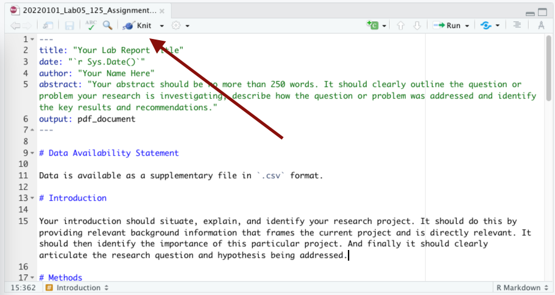
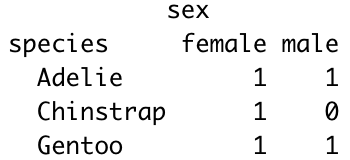
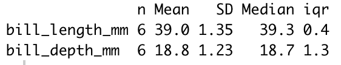
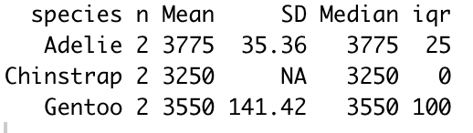
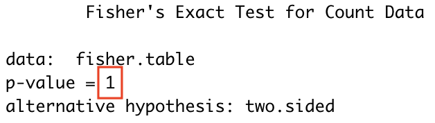
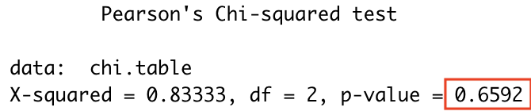
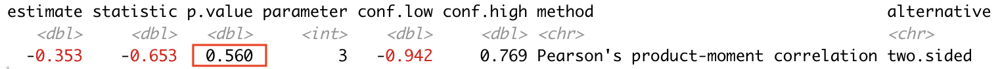
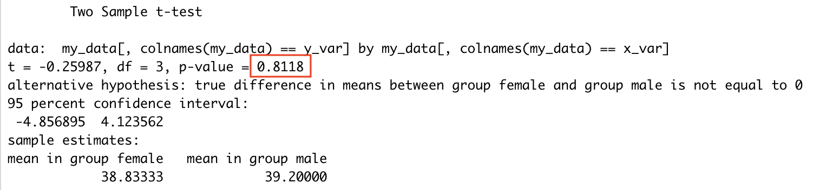
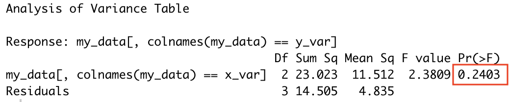

# (PART\*) Lab 4 {-}

*Last updated `r Sys.Date()`*

# Open Science, R, & RMarkdown Tutorial {-}

You were introduced to Open Science practices, RMarkdown, and RStudio when you completed a Recommendation Report in BIOL 125. We will be using the same format and template for your Recommendation Report in BIOL 205. To prepare you for this, you must first complete this refresher Open Science, R, & RMarkdown tutorial and the accompanying quiz.

## Overview {-}

### Open Science {-}

Open Science is a movement that tries to combat the <a href="https://ubco-biology.github.io/Procedures-and-Guidelines/glossary#Replication-crisis">replication crisis</a>, <a href="https://ubco-biology.github.io/Procedures-and-Guidelines/glossary#Questionable-research-practices">questionable research practices</a>, and flashy research trumping quality research in two ways. First, by providing different incentives and rewards for research. That is, changing what we measure as a success in research, shifting from a culture that emphasizes novel findings to one that also rewards the many other aspects of practicing good science. Second, by making all parts of the scientific research process <a href="https://ubco-biology.github.io/Procedures-and-Guidelines/glossary#Transparency">transparent</a> and accessible, allowing for a critical review of how a study was conducted, and ultimately enabling that study to be independently <a href="https://ubco-biology.github.io/Procedures-and-Guidelines/glossary#Replication">replicated</a>. 

<div class = "advanced">
For an optional refresher of Open Science principles and core values, visit the [Open Science 101 Module](https://ubco-biology.github.io/OS-Introduction/principles-of-open-science.html) that was covered in BIOL 116.
</div>

### Registered Reports {-}

Writing a <a href="https://ubco-biology.github.io/Procedures-and-Guidelines/glossary#Registered-report">registered report</a> involves submitting your research question, <a href="https://ubco-biology.github.io/Procedures-and-Guidelines/glossary#Hypothesis">hypotheses</a>, and planned methods for <a href="https://ubco-biology.github.io/Procedures-and-Guidelines/glossary#Peer-review">peer review</a> prior to beginning data collection. Using this format enhances research quality because it gives researchers a chance alter study design and methods before investing time into data collection. Just think of a time where you spent countless hours writing an essay thinking it was perfect, only to give it to a friend to read and receive a ton of editing comments. Often readers notice things the author doesn't! Pre-registering a report also helps avoid questionable research practices like selective reporting of results and publication bias. 

For your Recommendation Report in BIOL 205, you will follow the stages of a typical <a href="https://ubco-biology.github.io/Procedures-and-Guidelines/glossary#Registered-report">registered report</a> and implement the following Open Science practices while working on your project:

* Using appropriate <a href="https://ubco-biology.github.io/Procedures-and-Guidelines/glossary#Version-control">version control</a> on electronic documents and proper <a href="https://ubco-biology.github.io/Procedures-and-Guidelines/glossary#File-and-data-management">file and data management</a> practices throughout the experiment. 
    * Be sure to follow the rules outlined in Chapters 1-5 [File and Data Management](https://ubco-biology.github.io/Procedures-and-Guidelines/file-and-data-management.html) in the UBCO Biology Procedures & Guidelines Document.
* Performing a <a href="https://ubco-biology.github.io/Procedures-and-Guidelines/glossary#Literature-review">literature review</a> on your research topic and documenting a list of consulted studies, how they were found, and the strengths, limitations, and weaknesses of each.
* Submitting a research proposal draft with an established <a href="https://ubco-biology.github.io/Procedures-and-Guidelines/glossary#A-priori-hypothesis">a priori hypothesis</a>, experimental design, and plan for presenting and analyzing your data. This will be marked before the experiment implementation phase and TA feedback incorporated into the project as needed. Creating a detailed, thorough plan for your research often takes as much time as running the experiment and collecting and analyzing your data. The more you plan, including anticipating potential problems, the easier the implementation!
* Implementing the study according to your plan, and noting any deviations from that plan (Note: deviations often happen, and that's OK! The key is to document them). These reflections will be submitted for marks.
* Submitting and presenting a poster that details your experiences implementing the research plan (including any changes recorded, justification for changes, <a href="https://ubco-biology.github.io/Procedures-and-Guidelines/glossary#Statistical-analysis">analysis</a> of the data, and your interpretation and conclusion).

### Why Use R & RMarkdown? {-}

While there are numerous programs that you can use to write lab reports, research manuscripts, and perform <a href="https://ubco-biology.github.io/Procedures-and-Guidelines/glossary#Statistical-analysis">statistical analysis</a>, there are so many benefits to using <a href="https://ubco-biology.github.io/Procedures-and-Guidelines/glossary#R">R</a> & RMarkdown!

First, R is both free and open source! Moreover, using R allows for computational reproducibility of your work. Computational reproducibility is the ability to document data and analyses so that others can understand and replicate the computations that led to the results and conclusions.

While you could use R to perform statistical analyses and write your report separately using a program like Microsoft Word. By using RMarkdown to write your lab report, you can include data analyses directly within the report which allows for everything to be stored in a single document. This makes it simple for readers to understand the computations used to conduct analyses as they read through your paper. Also, remember that there are free versions of R & RStudio, while programs like Microsoft Word require purchased subscriptions. For your Recommendation Report in BIOL 205 you won't be expected to have the code for your anaylses directly embedded within your RMarkdown document but you will use pre-made R scripts to perform analyses.

### Scientific Writing, Installation of R & RStudio {-}

For a refresher on scientific writing, the different sections of a lab report, and setting up R & RStudio, see the BIOL 125 Lab Manual here [https://ubco-biology.github.io/BIOL-125-Lab-Manual/recommendation-report.html](https://ubco-biology.github.io/BIOL-125-Lab-Manual/recommendation-report.html). **Read all of the subsections under the Recommendation Report.**

## Assignment Template {-}

You will use the following template for your Recommendation Report:

[20220824_Lab03_205_Assignment_V1.Rmd](https://osf.io/download/g5zxk) 

Before starting your Recommendation Report, we'll spend some time going through the different parts of this template.

### Using the Template {-}

<div class = "note">
All the markdown syntax that you need for RMarkdown can be found in the [Markdown](https://ubco-biology.github.io/Procedures-and-Guidelines/markdown-1.html) section of the BIOL Procedures and Guidelines.
</div>

### Directory Structure & File Naming {-}

It is expected that you will have a root project folder for your work associated with this lab. And that at the minimum you will have a folder for your report, your data, and your figures. And that you will download this template into your `report/` directory. And that lastly, you will rename the template in accordance with the file naming conventions in the [Biology Procedures and Guidelines document](https://ubco-biology.github.io/Procedures-and-Guidelines/file-naming.html).

This structure and hierarchy will be important when it comes time to include figures and images in your report.

### YAML {-}

The top of the template contains some front matter called YAML. YAML provides instructions to all the pieces of software involved in converting your RMarkdown document to it\'s outputs, in this case, `pdf`. YAML is very specific to spacing, so don\'t add any extra spaces!

What you need to do.

1. Provide a title within the quotations after `title`.
2. Provide your name within the quotations after `author`.
3. Provide your abstract within the quotations after `abstract`.

What might be nice to know.

1. <code>r Sys.Date()</code> pulls the date from your computer and auto populates this for you.
2. The `output` tag defines the output format. Other options include `html_document` and `word_document`.

<div class = "advanced">
What exactly is YAML?

> YAML™ (rhymes with “camel”) is a human-friendly, cross language, Unicode based data serialization language designed around the common native data types of dynamic programming languages. It is broadly useful for programming needs ranging from configuration files to internet messaging to object persistence to data auditing and visualization.

Read more at [the Official YAML Web Site](https://yaml.org/)
</div>

### Document Body {-}

The template is then pre-populated with first level headers for each section you\'re expected to include in your report. Each heading re-iterates the key elements the content of these headings should address. This is just place holder text, so replace it with your own.

### Images & Graphs {-}

There is one sample graph included. Note how it references the figure to be included `../figures/image-name.png` The `../` means \'go one level up in the directory\' which, if you have your project set up in the following way and your `.Rmd` file is in your `report/` directory it means \'look in the `root/` directory for a folder called `figures/`.

```
root/
  report/20220101_Lab05_125_Assignment_V1.Rmd
  data/
  figures/MVD_BIOL125-Lab5_Fig-1-Boxplot_V1.png
```

If you make a mistake in setting this path, you\'ll get the following error in RStudio

```
(No image at path ...)
```

You\'ll also note the following directly after the image path: `{width=50%}`. This reduces the image size by 50%. 

As noted in the template, you do not need to write `Figure 1:` before your figures; this small piece of text is handled during the conversion from RMarkdown to pdf. Any other information that you would like to include in the caption should go in the `[]` before the `()` that contain the path to the image.

<div class = "note">
Figure placement

The engine behind the conversion from RMarkdown to pdf is a typesetting application, one with pretty strict rules about how content should be formatted - much more strict than something like Microsoft Word.

What this means is that if the placement of your images will disrupt your prose - by creating large amounts of empty white space for example - this typesetting application will *push* your figure to somewhere lower in your report where it won\'t create this white space.

Your figures should be adjacent to the relevant text in your RMarkdown file. How this manifests to your pdf might look a little different; that\'s ok.
</div>

### References {-}

Just before the heading for references you\'ll see the following

```
\clearpage
```

This creates a page break between your references section and the rest of your report.

### Building the `pdf` {-}

If you've installed `R`, RStudio, and the `markdown` and `tinytex` packages succesfully, when you open the template `.Rmd` file you should see an option to `Knit`.



Click this button or select the drop down arrow and select `Knit to pdf`. This will generate a pdf in the same directory as your `.Rmd` file.

## Using the RScripts {-}

R scripts are text files containing the commands (aka code) and comments used to perform computations. For your research project, R scripts have been pre-written for you! You won't need to learn how to write code in R for this course; that comes later in BIOL 202. 

There is a separate R script for each type of variable combination you might have for your project. Download the R script that corresponds to the types of variables you have in your experiment. 

* Both response and explanatory variables are categorical 
    * [BIOL205_Script_Categorical-Categorical.R](https://osf.io/download/sg7y6)
* Both response and explanatory variables are quantitative 
    * [BIOL205_Script_Quantitative-Quantitative.R](https://osf.io/download/adwg4)
* Categorical explanatory variable and quantitative response variable 
    * [BIOL205_Script_Quantitative-Categorical.R](https://osf.io/download/46mpk)

While there are instructions within the R scripts themselves, the following sections describe how to use the R scripts in more detail. Be sure to read **everything here and in the R scripts!** Alongside each line of code in the script is a comment proceeded with a hashtag (#). The comments are either descriptions of what the code is doing or instructions describing things you need to do.  

### Step 1: Set your working directory {-}

Make sure your working directory is set according to the instructions [here](https://ubco-biology.github.io/Procedures-and-Guidelines/set-a-working-directory-in-rstudio.html) in the Procedures and Guidelines Document.

### Step 2: Installing & Loading Required Packages {-}

Packages in R contain a set of functions, code, and data that you can use for your analysis. Before you can use the functions within a package, the package must be installed in R. Once a package is installed on your computer you won't need to re-install it every time you use R. However, if you\'re on a lab computer, since the computers are re-set at the end of each day you may need to re-install packages at each log in.

To install packages noted in the R script, copy the installation lines of code without the preceeding hashtag (#) ie. remove the # from `# install.packages("ggplot2")` so it looks like this `install.packages("ggplot2")` and copy it into the R console (lower left pane of RStudio). When you push enter on your keyboard the package will install. Be sure to do this for all of the required packages noted in the R script. 

Once packages are installed, they must be loaded to your current session in R. You will have to do this each time you re-start R. To load packages use the library function by running the lines of code pre-written into your R script. For example, run `library(ggplot2)` by clicking the 'Run' button at the top right of the working document. 


### Step 3: Uploading your data {-}

Replace 'insert-data-file-name-here.csv' with the file name that your data is saved as to your computer. If your data file contains a header row, be sure that `my_data <- read.csv(file = my_file, header = TRUE)` shows `header = TRUE`. If you have no header row, simply change the code to `header = FALSE`. 
    
### Step 4: Visualizing your data {-}

You'll need to tell R some information before you can create graphs. Specifically, you need to assign the names of your variables, axes labels, and figure caption. You can do this by 

* Replacing "X variable name" and "Y variable name" with the names of your x and y variables
* Replacing "X label name" and "Y label name" with your desired x and y axes labels
* Replacing "My Caption" with your desired figure caption

In the R script for a categorical explanatory and a categorical response variable, code for both a boxplot and a stripchart is included. Recall that according to the [Biology Procedures and Guidelines document](https://ubco-biology.github.io/Procedures-and-Guidelines/figures.html), you should use a boxplot if the groups of your categorical variable have more than 20 data points. Alternatively, you should use a stripchart if each group contains less than 20 data points. Be sure to only produce one desired figure. 

<div class = "advanced">
In some of the R scripts there are some additional pieces of code that you don't need to worry about for now; you'll learn more about these in BIOL 202!

For example, we have to factor the categorical variables before producing graphs. You will see this additional code if the script you are using includes categorical variables. 

In the code for creating a boxplot or stripchart, we refer to a function that calculates confidence intervals. So we have to define that function prior to running the code to produce the figure. You will find this additional piece of code in your R script if your experiment has a categorical explanatory variable and quantitative response variable.

There are some regions in the R scripts where variables are re-named or manipulated. Don't worry about why for now! 
</div>

Now you're ready to run the code to create your figure! Once the code has been run, your figure will show in the lower right panel of RStudio under 'Plots'. To save your figure click the 'Export' button and then 'Save as Image'. 

### Step 5: Calculate descriptive statistics {-}

The code here should run smoothly if everything in the proceeding steps was done correctly. Once the code has been run, your descriptive statistics will be printed in the console of RStudio (lower left panel). The instructions below describe how to interpret this output depending on the types of variables in your experiment. 

**Two Categorical Variables**

Here is an example of the <a href="https://ubco-biology.github.io/Procedures-and-Guidelines/glossary#Descriptive-statistics">descriptive statistics</a> output produced by the R script for two categorical variables. The explanatory (independent) variable and its associated groups appear in the first column, while the response (dependent) variable appears at the top. In this case the explanatory variable was species and the response variable was sex. The numbers provided in the table describe the frequency for each category. For example, in this sample there was 1 female Adelie penguin and 0 male Chinstrap penguins. 



**Two Quantitative Variables**

Here is an example of the output produced by the R script for two quantitative variables. The explanatory (independent) variable appears in the first row, while the response (dependent) variable appears in the second row. `n` indicates the sample size, while the following columns represent the <a href="https://ubco-biology.github.io/Procedures-and-Guidelines/glossary#Mean">mean</a>, <a href="https://ubco-biology.github.io/Procedures-and-Guidelines/glossary#Standard-deviation">standard deviation</a>, <a href="https://ubco-biology.github.io/Procedures-and-Guidelines/glossary#Median">median</a>, and <a href="https://ubco-biology.github.io/Procedures-and-Guidelines/glossary#Interquartile-range">interquartile range</a>, respectively.  



**One Categorical and One Quantitative Variable**

Here is an example of the output produced by the R script for one categorical and one quantitative variable. This table is organized so that the descriptive statistics of the quantitative response variable are reported based on the groups of the explanatory variable. `n` indicates the sample size, while the following columns represent the mean, standard deviation, median, and interquartile range, respectively. For example, the mean mass (g) for Adelie penguins in this sample is 3775 g. 



Take a screenshot of these values or write them down for writing your lab report later. 

### Step 6: Performing statistical analyses {-}

Similar to with the descriptive statistics, the code here should run smoothly if everything in the proceeding steps was done correctly. The type of <a href="https://ubco-biology.github.io/Procedures-and-Guidelines/glossary#Statistical-analysis">statistical analyses</a> you will perform depends on the types of variables in your experiment. Code for all possible statistical tests is included within the R scripts. **Only run the code that corresponds with the type of variables in your experiment.** Use the guidelines below to help you choose the appropriate statistical test:

* Both your response (dependent) and explanatory (independent) variables are **categorical**
    * Both your response and explanatory variables have exactly 2 groups -> Use Fisher's Exact Test
    * At least one of your response or explanatory variables has more than 2 groups -> Use Chi-Square Contingency Analysis 
* Both your response (dependent) and explanatory (independent) variables are **quantitative** -> Use Correlation Analysis
* Your response (dependent) variable is **quantitative** and your explanatory (independent) variable is **categorical** 
    * Your categorical variable has exactly 2 groups -> Use Two Sample T-test
    * Your categorical variable has more than 2 groups -> Use ANOVA
    
When interpreting the output from a statistical analysis for this project, focus on the <a href="https://ubco-biology.github.io/Procedures-and-Guidelines/glossary#P-value">p-value</a> provided by R. You'll learn more about the other details shown by the output in BIOL 202! Below are some examples of output for each type of statistical test. The associated p-value has a red box around it. 
    
**<a href="https://ubco-biology.github.io/Procedures-and-Guidelines/glossary#Fisher's-exact-test">Fisher's Exact Test</a>**



**<a href="https://ubco-biology.github.io/Procedures-and-Guidelines/glossary#Chi-square-($\chi$^2^)-contingency-test">Chi-Square Contingency Analysis</a>**



**<a href="https://ubco-biology.github.io/Procedures-and-Guidelines/glossary#Pearson-correlation">Correlation Analysis</a>**



**<a href="https://ubco-biology.github.io/Procedures-and-Guidelines/glossary#Two-sample-t-test">Two-Sample T-test</a>**



**<a href="https://ubco-biology.github.io/Procedures-and-Guidelines/glossary#Analysis-of-variance">ANOVA</a>**


    
<div class = "advanced"> 
OPTIONAL!

If you would like to have the code directly embedded within your RMarkdown report. Feel free to use the template below that corresponds with the types of variables in your research project. All of the code within these templates is the same as those described above but there are no instructions embedded in these templates. 

* Both response and explanatory variables are categorical 
    * [20220824_Lab03_205_Assignment-Categorical-Categorical_V1.Rmd](https://osf.io/download/98vmu)
* Both response and explanatory variables are quantitative 
    * [20220824_Lab03_205_Assignment-Quantitative-Quantitative_V1.Rmd](https://osf.io/download/75q4x)
* Categorical explanatory variable and quantitative response variable 
    * [20220824_Lab03_205_Assignment-Quantitative-Categorical_V1.Rmd](https://osf.io/download/s7bng)

Similar to the R scripts, code for all possible statistical tests is included within these templates. **Only include the code that corresponds with the type of variables in your experiment.** In other words, delete the R chunk that contains code for any statistical test you are **NOT** using. 

Similarly, code for both a boxplot and a stripchart is included within the quantitative-categorical template. If you plan to include a boxplot and not a stripchart, be sure to delete the R chunk that contains the code for the stripchart.

</div>

# Quiz 2: Open Science, R, & RMarkdown {-}

Before starting this quiz, you must:

* practice knitting the assignment template RMarkdown file
* practice using the R script for a categorical explanatory variable and quantitative response variable 

**The quiz will ask you to upload a screenshots from these files and will have questions from the output of the R script!**

## Practicing Knitting {-}

If you haven\'t already downloaded the assignment template, here it is again:

[20220824_Lab03_205_Assignment_V1.Rmd](https://osf.io/download/g5zxk) 

To test the template, 

* insert your name as the author in the YAML header
* ensure the template `.Rmd` file is in your `report/` directory 
* download the following image into your `figures/` directory
    * [MVD_BIOL205-Lab5_Fig-1-Boxplot_V1.png](https://osf.io/download/zuehg) (4 KB)
* knit the document to a PDF

You should get something that looks like this after `Knitting` the `.Rmd` file

* [20220824_Lab05_205_Assignment_V1.pdf](https://osf.io/download/3k8ve) (180 KB)

**Your knitted document should show your name under the title!** Take a screenshot of the first page of the knitted assignment template. You'll need to upload this screenshot to the quiz on Canvas. 

## Practicing Using the R Scripts {-}

We\'ll practice using the R script for a categorical explanatory variable and quantitative response variable. Follow these steps:

* Download the R script 
  * [BIOL205_Script_Quantitative-Categorical.R](https://osf.io/download/46mpk)
* Download this sample data set
  * 
* Follow the instructions provided [earlier]() and run *ALL* code in the script
  * Save the boxplot produced to your computer. You will need to upload this to the quiz on Canvas
  * Keep the results of descriptive statistics and statistical analyses open while you complete the quiz. You will need some of these values to answer questions!
  
## Complete the Quiz {-}

Now you\'re ready to start the quiz. Complete the Quiz titled Open Science, R, & RMarkdown on [Canvas](https://canvas.ubc.ca/courses/98621). 

# Assignment 3: Research Proposal Draft {-}

You will use the following template for your Recommendation Report:

[20220824_Lab03_205_Assignment_V1.Rmd]() (3 KB)

**Due before the start of your lab the week of February 7th** 

<div class = "flag">
You will need to submit 4 files for this assignment:

* Recommendation report as `.Rmd`
* Recommendation report as `.pdf`
* Data in <a href="https://ubco-biology.github.io/Procedures-and-Guidelines/glossary#Long-format-data">long</a>, tidy, format as <a href="https://ubco-biology.github.io/Procedures-and-Guidelines/glossary#Comma-separated-values-(CSV)-file">`.csv`</a>
* Data dictionary as `.md`
</div>

You will receive your marked recommendation report one week from the time it is submitted.

You can decide to resubmit the same recommendation report draft without making any changes or you will have the opportunity to review the edits and make the needed changes in order to increase your mark.

If you have any questions regarding your mark and / or the comments from your TA please ensure you take the opportunity to chat with your TA to go over these. This will ensure that you are in the best position to attain the highest marks possible for this assignment.

**Ideas on Preparing a Research Proposal**

*	Read a lot!  It is important that you have a thorough understanding of the topic.  At the very least you should have at least 3 primary source papers you are referring too throughout your proposal.
*	Discuss your ideas with other students (not just your partner).  Get a feel for what everyone else is doing and the depth they are working in.
*	Start writing early!  Students often make the mistake of starting the night before the proposal is due.  This more than not results in poor submissions and thus lower grades.  You should expect that you will have at least 3 rounds of revisions before you submit.
*	Someone reading your proposal should be able to tell what question(s) you will address, why the topic is interesting and/or important, how you will approach the problem, the types of data you will collect, and how your research will advance the field.

As you work on the draft of your research proposal, be sure to consult the Final Research Proposal marking rubric [here](https://ubco-biology.github.io/BIOL-205-Lab-Manual/research-proposal-rubric.html)!