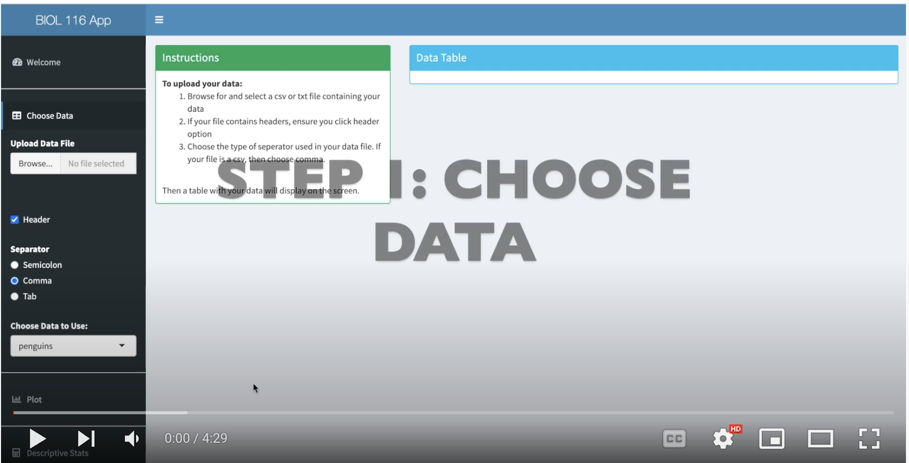

# (PART\*) Lab 9 - BIOL 205 {-}

*Last updated `r Sys.Date()`*

# Data Analysis {-}

For the data <a href="https://ubco-biology.github.io/Procedures-and-Guidelines/glossary#Statistical-analysis">analysis</a> portion of your presentation, you are permitted to use any operating program you are comfortable with.  R shiny is a very simple way to run some basic stats however you are more than welcome to use R, SPSS, or even Excel depending on your needs and comfort level.  Biol 202 is going to be a great resource for you so take a look through your notes. There is no assignment due for this module however you should meet with your TA online to discuss the statistical options you plan to pursue your data set and be able to explain why. This will help give your TA an opportunity to guide you and ensure you are appropriately analyzing your data in order to have the best outcome for your presentation. 

R is a great way to produce your graphs however students are permitted to use whichever program they feel most comfortable using.

# Analysis Using R Shiny {-}

If you are a bit uncomfortable using R, the R Shiny App is a nice way to work through your data without requiring an understanding of R.

For more information on using R Shiny please visit the following link [https://ubco-biology.github.io/BIOL-116-Lab-Manual/intro-to-r-shiny-apps.html](https://ubco-biology.github.io/BIOL-116-Lab-Manual/intro-to-r-shiny-apps.html)

The Shiny app you can use to run your analysis can be found here at [https://openscience.ok.ubc.ca/shiny/BIOL-116](https://openscience.ok.ubc.ca/shiny/BIOL-116)

The YouTube video here can be used to walk you through the steps of using the R Shiny App 
 
You may wish to refer back to the section on [Preparing your data](https://ubco-biology.github.io/BIOL-116-Lab-Manual/preparing-your-data.html) from BIOL 116 and the chapter [Tidy Data](https://ubco-biology.github.io/Procedures-and-Guidelines/tidy-data.html) in the UBCO Biology Procedures and Guidelines document. 

# Analysis Using Excel {-}

Below are a few videos which can help you get acquainted with running statistical analysis in Excel. There are much more available but this should help get you started.

* [Basic Data Analysis in Excel - 1](https://www.youtube.com/watch?v=2xxMJEj4Oyg)
* [How to Perform Regression Analysis in Excel](https://www.youtube.com/watch?v=0wr9ojMxkuQ)
* [How to Perform A One-Way ANOVA in Excel](https://www.youtube.com/watch?v=ZvfO7-J5u34)
* [How to Perform a Chi-Square Test of Independence in Excel](https://www.youtube.com/watch?v=NDhmMH25AC4)

